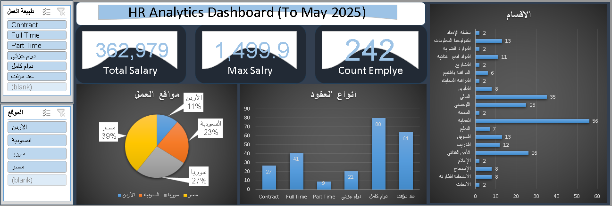

# HR Analytics Dashboard (Excel)

## 📊 Project Overview
This project presents an interactive HR analytics dashboard built using Microsoft Excel to analyze workforce distribution, salary insights, employment types, and employee satisfaction levels. The dashboard enables HR stakeholders to monitor key metrics and uncover workforce patterns.

---

## 🎯 Objective
The objective of this project is to explore HR data and develop a dashboard that supports workforce analysis, highlights organizational trends, and assists in data-driven HR decision-making.

---

## 🛠 Tools & Technologies
- Microsoft Excel  
- Pivot Tables  
- Data Cleaning  
- Data Visualization  

---

## 📌 Key Performance Indicators (KPIs)
- **Total Salary:** Represents total workforce compensation expenditure.  
- **Max Salary:** Indicates the highest salary value within the organization.  
- **Employee Count:** Reflects the total number of employees analyzed.  

---

## 🔎 Key Analysis
- Employee distribution by department  
- Geographic workforce distribution  
- Employment type segmentation  
- Salary overview and workforce size  
- Satisfaction level distribution  

---

## 💡 Key Insights
- Workforce concentration exists within core departments, highlighting operational priorities.  
- Egypt represents the largest share of employees, indicating geographic workforce centralization.  
- Full-time and contract employment dominate the workforce structure.  
- Salary distribution reflects hierarchical compensation patterns.  
- Satisfaction levels vary across employee groups, suggesting opportunities for engagement improvement.  

---

## 📷 Dashboard Preview

---

## 📂 Project Files
- Excel Dashboard (.xlsx)  
- Dataset (Excel/CSV)  
- Screenshots  
- README documentation  

---

## 🚀 Future Improvements
- Add average salary KPI  
- Enhance dashboard interactivity  
- Integrate automation using Python  
- Expand HR insight documentation  

---

## 👤 Author
**Badr Hamada**  
Junior Data Analyst
